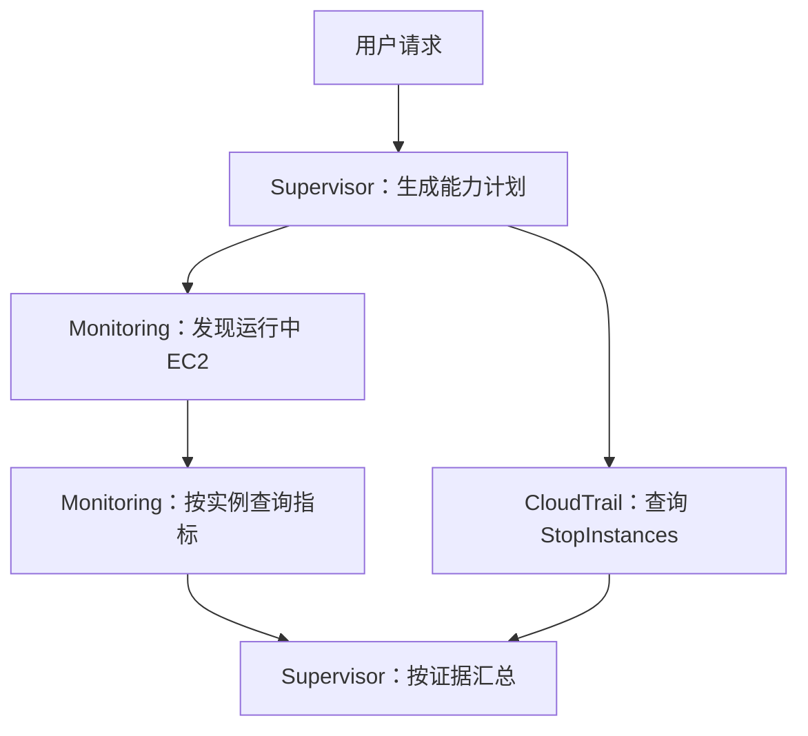

# 5. CloudOps 例子实践

把前面学到的 Runtime、Gateway 和 Harness 组合起来，完成真实运维查询。本章采用当前 CloudOps 方案中的查询链路，选取 Monitoring、CloudTrail、AgentCore 专家做学习实践。

## 5.1 先看一个完整问题

```text
查一下宁夏区运行中 EC2 的性能指标，并检查今天有没有关机操作。
```

期望系统先发现真实资源，再按实例 ID 查询指标；同时查询关机审计，最后按资源和时间窗关联证据。它不能因为用户没提供实例 ID 就直接停止，也不能仅拿账户聚合指标推断具体资源。



## 5.2 三个专家分别能做什么

| Agent | 能力 | 所需工具 | 实际业务权限位置 |
| --- | --- | --- | --- |
| Supervisor | 理解请求、选能力、生成计划、汇总 | 委派/任务接口 | 只调用获准专家 Runtime；不用获得所有业务 API 权限 |
| Monitoring | 发现 EC2、查询指标 | EC2 / CloudWatch 只读查询 | 查询 Lambda execution role |
| CloudTrail | 查询关机等管理事件 | CloudTrail LookupEvents | 审计 Lambda execution role |
| AgentCore | 发现 Runtime、查询平台配置、协助定位指标 | AgentCore 只读 API、必要的文档工具 | 平台查询 Lambda role；读取文档另配工具 |

专家之间通过任务输入/输出协作。给某专家列出工具名只是路由约束；权限仍由角色和工具参数校验落实。[能力目录](capability-catalog.md)

## 5.3 从上一个部署实验改成业务工具

步骤 3.2 的 `get_learning_status` 已证明链路可通。接下来增加独立只读工具，逐个测试，不直接把整个账户权限交给 Runtime。

| 工具 | 参数 | 返回的必要字段 | IAM Action |
| --- | --- | --- | --- |
| discover_running_ec2 | region | instance_ids | ec2:DescribeInstances |
| query_ec2_metrics | region、instance_ids、start/end | 按实例分组的指标、时间戳、空数据说明 | cloudwatch:GetMetricStatistics，按实现增加 ListMetrics / GetMetricData |
| query_stop_events | region、start/end | 时间、事件、实例 ID、脱敏操作主体 | cloudtrail:LookupEvents |
| discover_agentcore_runtimes | region | runtime 标识和状态 | bedrock-agentcore:ListAgentRuntimes / GetAgentRuntime |

这些 Describe / List / CloudWatch 查询中的一些 API 不支持资源级 ARN 限定，可能需要 `Resource: "*"`；此时仍限制 Action、请求区域、工具输入和输出。不能把“需要查详情”变成写权限。

例如 EC2 发现工具的核心代码：

```python
client = boto3.Session(region_name=region).client("ec2")
ids = []
for page in client.get_paginator("describe_instances").paginate(
    Filters=[{"Name":"instance-state-name","Values":["running"]}]
):
    for reservation in page["Reservations"]:
        ids.extend(instance["InstanceId"] for instance in reservation["Instances"])
```

指标查询必须用上述实际 ID，不能猜名字：

```python
result = cloudwatch.get_metric_statistics(
    Namespace="AWS/EC2", MetricName="CPUUtilization",
    Dimensions=[{"Name":"InstanceId","Value":instance_id}],
    StartTime=start, EndTime=end, Period=300,
    Statistics=["Average","Maximum"],
)
```

再按步骤 3.2 给 Lambda 添加 schema、注册 target、赋予精确只读动作、列举并实际调用。不要假定 schema 存在就代表 API 有权限。

## 5.4 时间窗和资源关联

“今天”按业务时区定义。本例使用北京时间：本地 00:00 转为 UTC 后再传给 CloudWatch / CloudTrail，结束时间为本次查询时刻。不能将 UTC 当天当成北京时间当天。

查 StopInstances 时遍历 LookupEvents 分页，再解析 `CloudTrailEvent` 内的 `requestParameters.instancesSet.items` 取得实例 ID。`Resources` 字段不一定提供完整关联信息。

当前 running 列表不能代表今天运行过的所有机器；查询关机事件应独立查询本时间窗，并报告事件涉及哪些实例，包括当前已停止或后来恢复的实例。没有匹配事件也只能描述查询范围的结果，不能保证组织所有账户都未关机。

CPU 指标不代表全部性能。基础 EC2 指标不含操作系统内存使用率；需要内存时应检查 CloudWatch Agent 等额外采集是否存在，不能编造。

## 5.5 在学习环境先跑确定性实验

```powershell
python labs/cloudops-mini/workflow.py
```

离线模式使用明确标记的虚构 ID/数据，验证“发现 → 指标”和“审计并行”的工作流结构。需要真实只读查询时：

```powershell
python labs/cloudops-mini/workflow.py --live --region cn-northwest-1
```

真实模式使用本地 AWS 身份调用只读 API，并把结果放入 `.local/`。它用于理解查询实现，不是已部署的多 Agent；真正应用把同样查询放到 Gateway 的 Lambda，再由专家 Runtime 调用。[实验说明](../labs/cloudops-mini/README.md)

## 5.6 接入真正的专家和 Supervisor

1. 在每个专家代码中创建 AgentCore 应用入口，连接自己的模型与 Gateway 工具。模型端点、网络和凭证需在你的环境独立配置；前面的 echo Runtime 没有 LLM。
2. 按 3.1 的容器/角色/Runtime 流程部署不同名称的专家。不要直接重复执行固定名称学习脚本；它服务于入门单 Runtime。
3. 配置 Supervisor 可调用的专家 Runtime ARN，身份策略限定这些 Runtime 与 endpoint。跨 Runtime 调用采用 boto3/SigV4，和 3.1 的 Invoke 一致。
4. 给 Supervisor 能力目录和计划输出 schema，用 Harness 校验及推进依赖。指标步骤消费发现步骤返回的 instance_ids，不让模型重新猜测。
5. 保存每个 task 的状态与证据。最终汇总只引用成功结果，报告未完成项和真实失败原因。

参考 AWS Sample 的 [配置驱动多 Agent 项目](https://github.com/aws-samples/sample-cloudops-multi-agent-system)，学习其层级配置、Gateway 接入和工具追踪；中国区如何取舍见 [参考对照](../04-harness/reference-project-comparison.md)。本仓库教学例子使用较少专家，让读者先掌握协作链路。

## 5.7 用这些问题验收

| 场景 | 测试问题 | 必须看到的行为 |
| --- | --- | --- |
| 不指定专家 | 宁夏运行中 EC2 的 CPU 如何？ | 自动发现资源并查询；实际调用记录可见 |
| 两种领域 | 宁夏运行中 EC2 的性能和今天关机情况 | Monitoring 两步，CloudTrail 独立查询，证据关联 |
| 指定多个专家 | 请 AgentCore 和 Monitoring 协作看 Runtime 指标 | 先确认资源与指标定义，再查实际维度；不猜指标名 |
| 无资源 | 学习环境没有运行中 EC2 | 明确“未发现运行中 EC2”，不生成假实例 |
| 权限不足 | 测试角色不允许 LookupEvents | 指标可报告，审计明确失败；任务终态可见 |
| 工具超时 | 在本地测试用延迟 stub 模拟工具超时 | 有限重试，截止后答复；不一直转圈 |
| 多页结果 | 在本地 mock 发现/API 返回多页 | 所有分页处理后再汇总 |

查看 [依赖工作流](dependency-workflow.md)、[观测与失败](observability-and-failures.md)。验收需要真实任务记录，不把本文预期结果说成线上实测。

## 最后参考完整项目

本章讲清楚查询链路后，可对照 [中国区 CloudOps Demo](https://github.com/zjinsong/China-Agentcore-Demo) 阅读完整控制面和 Runtime 实现。学习仓库只选取上述查询专家，不要求复制 Demo 的全部功能。上游参考为 [AWS Sample](https://github.com/aws-samples/sample-cloudops-multi-agent-system)。
