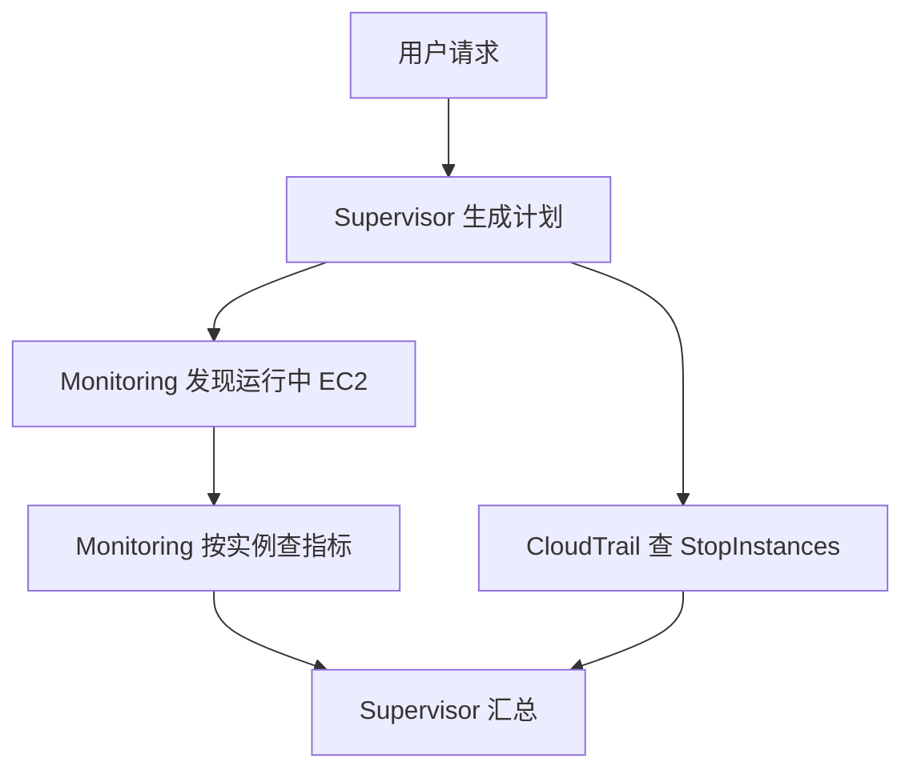

# 4. CloudOps 实践

把第 3 章的链路用在真实运维问题上,并理解多 Agent 之间用什么协议通信。

## 4.1 四种协议

Runtime 支持四种协议。**协议决定你的容器监听哪个端口、暴露什么路径**,创建 Runtime 时用 `protocolConfiguration.serverProtocol` 声明。

| | HTTP | MCP | A2A | AG-UI |
| --- | --- | --- | --- | --- |
| 端口 | **8080** | **8000** | **9000** | **8080** |
| 路径 | `/invocations`、`/ws` | `/mcp` | `/`(根) | `/invocations`(SSE)、`/ws` |
| 消息格式 | REST JSON / SSE / WebSocket | JSON-RPC | JSON-RPC 2.0 | 事件流(SSE/WebSocket) |
| 发现机制 | 无 | 工具列表 | Agent Cards | 无 |
| 用途 | 普通请求响应、流式 | 工具服务器 | Agent 之间通信 | 交互式 UI |

四种都支持 SigV4 和 OAuth 2.0。

### 怎么选

```text
我的组件是什么?
├── Agent 应用,被控制面/用户调用     → HTTP(8080)
├── 工具服务器,给 Agent 提供工具     → MCP(8000)
├── 专家 Agent,被其他 Agent 调用     → A2A(9000)
└── 要在网页上流式显示过程           → AG-UI(8080)
```

CloudOps 的实际用法:

```text
控制面 ──HTTP──> Supervisor Runtime ──A2A──> 专家 Runtime
                                              │
                                              └──MCP──> Gateway ──> Lambda 工具
```

### HTTP(8080 `/invocations`)

最简单,第 3 章用的就是它。容器要提供 `/invocations` 和 `/ping`:

```python
from bedrock_agentcore.runtime import BedrockAgentCoreApp
app = BedrockAgentCoreApp()

@app.entrypoint
def handler(event, context):
    return {"answer": "..."}

app.run()       # 自动监听 8080,提供 /invocations 和 /ping
```

`/ping` 返回 `{"status": "Healthy"}` 或 `{"status": "HealthyBusy"}`。返回 `HealthyBusy` 表示还在跑后台任务,**平台就不会因为空闲超时回收会话**——长任务靠这个保活:

```python
@app.get('/ping')
def ping():
    return {'status': 'HealthyBusy' if running_tasks else 'Healthy'}
```

### MCP(8000 `/mcp`)

工具服务器用。JSON-RPC,客户端先 `tools/list` 发现工具,再 `tools/call` 调用。

两种接法:

1. **Gateway 的 Lambda target**(推荐,第 3 章做的):工具写成 Lambda,Gateway 负责 MCP 协议,你不用自己实现
2. **自己跑 MCP server Runtime**:把现成的 MCP server(比如官方 `awslabs.aws-iac-mcp-server`)打包成容器,`serverProtocol: "MCP"`,监听 8000 `/mcp`

第 2 种要注意:MCP server 是**常驻进程**,会一直占一个 Runtime 持续计费。所以简单工具用 Lambda,只有复用现成 MCP server 才值得单独起 Runtime。

### A2A(9000 根路径)

Agent 之间通信。两个特点:

**Agent Card** —— 自我描述,放在 `/.well-known/agent-card.json`,让别的 Agent 知道你能干什么:

```python
@app.get('/.well-known/agent-card.json')
def card():
    return {
        'protocolVersion': '0.3.0',
        'name': 'monitoring',
        'description': '监控专家:查资源、指标、告警',
        'url': f'https://bedrock-agentcore.{region}.amazonaws.com.cn/runtimes/{quote(arn, safe="")}/invocations/',
        'preferredTransport': 'JSONRPC',
        'skills': [{'id': 'monitoring', 'name': 'monitoring', 'tags': ['cloudwatch']}],
        'securitySchemes': {'awsIam': {'type': 'http', 'scheme': 'AWS4-HMAC-SHA256'}},
    }
```

**JSON-RPC 2.0** —— 请求体长这样:

```json
{
  "jsonrpc": "2.0",
  "id": "1",
  "method": "message/send",
  "params": {
    "message": {
      "contextId": "conv-123",
      "parts": [{"kind": "text", "text": "查宁夏运行中的 EC2"}],
      "metadata": {"task_id": "task-456"}
    }
  }
}
```

容器监听 **9000**,路径是**根** `/`。

### AG-UI(8080 `/invocations` SSE)

要在网页上实时看到 Agent 思考和调工具的过程时用。事件流格式,前端收到 `TEXT_MESSAGE_CONTENT`、`TOOL_CALL_START` 这类事件逐步渲染。

Strands 生态里用 `ag_ui_strands`(AG-UI 社区维护的桥接库,不是 AWS 官方):

```python
from ag_ui_strands import StrandsAgent, StrandsAgentConfig, create_strands_app

app = create_strands_app(
    agent=StrandsAgent(agent=my_strands_agent, name="supervisor"),
    path="/invocations",
    ping_path="/ping",
)
```

注意:它**接管了调用循环**,所以记忆不能像 HTTP 版那样手写 load/save,要通过 `session_manager_provider` 传一个 Strands `SessionManager`(比如 `S3SessionManager`)。

## 4.2 一个完整的运维问题

```text
查一下宁夏区运行中 EC2 的性能指标,并检查今天有没有关机操作。
```

期望行为:



两个要点:

- 用户没给实例 ID,**不能直接停**,要先发现真实资源(步骤 D → M 是依赖关系)
- 查审计和查指标**无依赖,可以并行**(S → T 与 S → D 同时发出)

## 4.3 专家和工具

| Agent | 能力 | 工具 | 业务权限在哪 |
| --- | --- | --- | --- |
| Supervisor | 拆任务、派活、汇总 | 调专家 Runtime | 只需调专家的权限,不要业务 API 权限 |
| Monitoring | 发现资源、查指标 | EC2/CloudWatch 只读 | Monitoring 的 Lambda 执行角色 |
| CloudTrail | 查管理事件 | `cloudtrail:LookupEvents` | 审计 Lambda 执行角色 |
| AgentCore | 查平台资源 | `bedrock-agentcore:List*/Get*` | 平台查询 Lambda 角色 |

给专家列工具名只是**路由约束**,真实权限由 Lambda 角色和参数校验决定。

## 4.4 从 hello 工具改成业务工具

第 3 章的 `get_learning_status` 已经证明链路通了。现在加真实只读工具,一个一个测:

| 工具 | 参数 | 返回 | IAM Action |
| --- | --- | --- | --- |
| `discover_running_ec2` | region | instance_ids | `ec2:DescribeInstances` |
| `query_ec2_metrics` | region, instance_ids, start, end | 按实例分组的指标 | `cloudwatch:GetMetricData` / `GetMetricStatistics` |
| `query_stop_events` | region, start, end | 时间、事件、实例 ID | `cloudtrail:LookupEvents` |

发现 EC2:

```python
client = boto3.Session(region_name=region).client("ec2")
ids = []
for page in client.get_paginator("describe_instances").paginate(
    Filters=[{"Name": "instance-state-name", "Values": ["running"]}]
):
    for r in page["Reservations"]:
        ids.extend(i["InstanceId"] for i in r["Instances"])
```

查指标必须用**上一步拿到的真实 ID**,不能猜:

```python
cloudwatch.get_metric_statistics(
    Namespace="AWS/EC2", MetricName="CPUUtilization",
    Dimensions=[{"Name": "InstanceId", "Value": instance_id}],
    StartTime=start, EndTime=end, Period=300,
    Statistics=["Average", "Maximum"],
)
```

有些 Describe/List API 不支持资源级 ARN 限定,只能 `Resource: "*"`,这时靠限制 Action、区域和工具参数来收口。

## 4.5 两个容易错的细节

**时区**。"今天"按业务时区算。北京时间今天 00:00 要先转 UTC 再传给 CloudWatch/CloudTrail:

```python
from datetime import datetime, timedelta
from zoneinfo import ZoneInfo

tz = ZoneInfo("Asia/Shanghai")
now_local = datetime.now(tz)
start_local = now_local.replace(hour=0, minute=0, second=0, microsecond=0)
start_utc = start_local.astimezone(ZoneInfo("UTC"))
```

拿 UTC 当天当北京当天会差 8 小时。

**实例 ID 从哪取**。查 StopInstances 时,实例 ID 在事件详情里,不一定在 `Resources` 字段:

```python
for page in paginator.paginate(LookupAttributes=[
        {"AttributeKey": "EventName", "AttributeValue": "StopInstances"}],
        StartTime=start_utc, EndTime=end_utc):
    for e in page["Events"]:
        detail = json.loads(e["CloudTrailEvent"])
        items = detail.get("requestParameters", {}).get("instancesSet", {}).get("items", [])
        ids = [i["instanceId"] for i in items]
```

另外:当前 running 列表 ≠ 今天运行过的所有机器。关机审计要独立查时间窗,报告涉及哪些实例(包括现在已停的)。

## 4.6 先用离线实验理解流程

```bash
python3 labs/cloudops-mini/workflow.py
```

离线模式用明确虚构的 ID,验证"发现 → 指标"依赖和"审计并行"的结构,不调 AWS、不调模型。

真实只读查询:

```bash
python3 labs/cloudops-mini/workflow.py --live --region cn-northwest-1
```

结果写 `.local/cloudops-mini.json`。这是确定性工作流,帮你理解查询实现;真正的应用要把这些查询放到 Gateway 的 Lambda 里,由专家 Runtime 调用。

## 4.7 跑一个真的多 Agent

这个例子是 Supervisor + 两个专家,用**真实 A2A 协议**(Agent Card + JSON-RPC 2.0)通信,默认离线跑:

```bash
cd labs/multi-agent && ./run.sh
```

```text
计划(3 步):
  0. monitoring/discover_running_ec2 可并行
  1. monitoring/query_ec2_metrics 依赖[0]
  2. cloudtrail/query_stop_events 可并行

并行执行: ['步骤0', '步骤2']
  ✓ 步骤0 discover_running_ec2
  ✓ 步骤2 query_stop_events

并行执行: ['步骤1']
  ✓ 步骤1 query_ec2_metrics
```

正好对应 4.2 那张图:发现和审计并行,指标等依赖。同一个专家(monitoring)执行了两个不同能力。

看协议实际长什么样:

```bash
cd labs/multi-agent
PYTHONPATH=. python3 expert.py monitoring &
curl -s http://127.0.0.1:9001/.well-known/agent-card.json | python3 -m json.tool
kill %1
```

真实只读查询:`./run.sh --live --region cn-northwest-1`

详见 [labs/multi-agent/README.md](labs/multi-agent/README.md)。

## 4.8 从这个例子到真实部署

例子为了能本地跑做了简化,差距在这:

| 例子里 | 真实部署 |
| --- | --- |
| 标准库 HTTP server,localhost 端口 | AgentCore Runtime,A2A 端口 9000 |
| 无鉴权 | SigV4 |
| 工具函数直接调 boto3 | 工具在 Gateway 的 Lambda target,专家通过 MCP 调 |
| 关键词匹配生成计划 | LLM 输出 JSON 计划 |
| 任务状态在内存 | DynamoDB 存任务,S3 存证据,SQS 唤醒 worker |

迁移步骤:

1. 每个专家按第 3 章流程打包部署,协议选 **A2A**(`serverProtocol: "A2A"`),监听 9000
2. 工具搬进 Gateway 的 Lambda target,专家改成通过 MCP 调用
3. Supervisor 的 `call_expert()` 换成 boto3 `invoke_agent_runtime`(SigV4 自动签名),IAM 策略限定只能调这些专家
4. `plan()` 换成 LLM,输出同样结构的 JSON —— **harness 校验逻辑不用改**
5. 任务状态换成 DynamoDB + S3

协议结构和 harness 逻辑是一样的,所以这几步是替换而不是重写。

## 4.8 验收用这些问题

| 场景 | 问题 | 必须看到 |
| --- | --- | --- |
| 不指定专家 | 宁夏运行中 EC2 的 CPU 如何? | 自动发现资源再查指标,有实际调用记录 |
| 跨领域 | 性能 + 今天关机情况 | Monitoring 两步,CloudTrail 并行,证据关联 |
| 指定多专家 | 请 AgentCore 和 Monitoring 一起看 Runtime 指标 | 先确认资源和指标定义,再查真实维度 |
| 没有资源 | 环境里没有运行中 EC2 | 明确说"未发现",不编造实例 |
| 权限不足 | 角色不允许 LookupEvents | 指标正常返回,审计明确失败,任务有终态 |
| 工具超时 | 用延迟 stub 模拟 | 有限重试,到期给答复,不无限转圈 |
| 多页结果 | mock 多页返回 | 分页处理完才汇总 |

关键区分三种情况,不能混:**真实数据** / **空数据** / **工具错误**。

- 权限错误 ≠ "今天没有关机"
- 指标空数据 ≠ "CPU 是 0"
- 某专家工具不够 ≠ 平台不支持

另外 EC2 基础指标**不含内存**,要内存得看有没有装 CloudWatch Agent,不能编。

## 4.9 再往下走

本章选了三个专家讲清协作链路。要扩成更多专家,照 4.8 的迁移步骤加就行:在 `capabilities.json` 加专家和能力,部署对应 Runtime,刷新能力清单。

配置驱动的多 Agent 结构可以参考 AWS 官方示例 [sample-cloudops-multi-agent-system](https://github.com/aws-samples/sample-cloudops-multi-agent-system)(基于 Global 的组件,中国区要按第 1 章的差异替换 Memory、Harness 等)。

下一步:[5. Harness 实践](05-harness.md)
