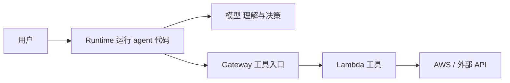

# China AgentCore Learning

在 AWS 中国区快速上手 Amazon Bedrock AgentCore:从了解可用功能,到亲手部署一个 agent。

五章,按顺序读。每章先讲概念,再动手。

| 章节 | 内容 | 读完会什么 |
| --- | --- | --- |
| [1. 中国区功能与替代方案](01-china-region.md) | 各服务作用、中国区可用性、不可用的替代方案 | 知道中国区能用什么、怎么选 |
| [2. Vibe coding MCP 快速上手](02-vibe-coding.md) | AgentCore MCP 接到编码助手 | 让助手查文档、改代码、帮你部署 |
| [3. 构建指南](03-build.md) | Runtime → Gateway → Lambda | 跑通一条真实可部署的链路 |
| [4. 构建一个 agent 应用](04-agent-app.md) | 模型 + 工具,一个天气助手 | 做出一个会调工具的 agent |
| [5. Harness 应用](05-harness.md) | 计划校验、依赖调度、失败处理 | 让多步任务可靠执行并有终态 |

## 全局图



Runtime 跑 agent 代码,模型负责理解和决策,工具通过 Gateway 调用。

## 环境

Linux(Ubuntu / Amazon Linux),默认宁夏 `cn-northwest-1`。需要:

```bash
python3 --version      # 3.12+
docker --version       # 需支持 buildx 构建 arm64
aws --version          # 2.37+
uv --version           # 第 2 章用,提供 uvx
```

配好中国区身份:

```bash
export AWS_PROFILE=china-learning
export AWS_REGION=cn-northwest-1
export AWS_DEFAULT_REGION=cn-northwest-1
aws sts get-caller-identity
```

**模型独立配置**。AgentCore 不含模型,中国区用第三方 OpenAI 兼容接口(DeepSeek、通义千问等),通过三个环境变量配置:

```bash
export MODEL_BASE_URL="https://api.deepseek.com/v1"
export MODEL_ID="deepseek-chat"
export MODEL_API_KEY="sk-xxxxxxxx"
```

实验从第 3 章起创建真实资源(产生费用,做完按 [清理](03-build.md#清理) 删除);资源标识写在 `.local/`(git 忽略)。

参考:[中国区功能差异](https://docs.amazonaws.cn/en_us/aws/latest/userguide/bedrock-agentcore.html) · [Runtime 协议契约](https://docs.amazonaws.cn/en_us/bedrock-agentcore/latest/devguide/runtime-service-contract.html) · [AgentCore MCP 入门](https://docs.amazonaws.cn/en_us/bedrock-agentcore/latest/devguide/mcp-getting-started.html)
