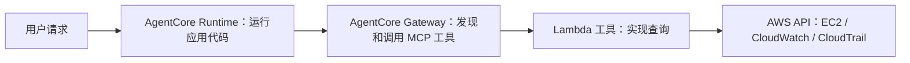

# China AgentCore Learning

在 AWS 中国区，从零学习 Amazon Bedrock AgentCore，再动手构建 CloudOps 多 Agent 应用。

按下面五部分读即可。每部分先讲用途，再给操作步骤和验证方法；源代码放在对应章节末尾供参考。

| 顺序 | 学习内容 | 读完能做什么 |
| --- | --- | --- |
| **1. [中国区服务功能](00-concepts/00-agentcore-cn-service-map.md)** | Runtime、Gateway、Identity、Observability、Browser、Code Interpreter；中国区与 Global 的差异 | 理解各服务分别解决什么问题，以及中国区怎么选 |
| **2. [Vibe coding MCP 使用](01-quickstart/README.md)** | MCP 用途、Kiro / Claude Code / Codex 配置、可直接使用的对话例子 | 让编码助手查文档、改代码、协助部署和验证 |
| **3. [部署指南](02-build-agentcore/README.md)** | 本地运行 → 中国区 ECR → Runtime → Gateway → Lambda 工具 → 联调 | 按步骤建立一条真实可部署的服务链路 |
| **4. [Harness](04-harness/README.md)** | 能力目录、计划校验、任务状态、依赖和失败处理 | 理解多 Agent 应用怎样可靠执行任务 |
| **5. [CloudOps 例子实践](03-cloudops-demo/README.md)** | Supervisor 调度 Monitoring、CloudTrail、AgentCore 专家；多场景验收 | 把部署链路和 Harness 用于运维查询 |

## 最终要搭什么

第二部分的开发用 MCP 安装在编码助手中，帮助你构建这条链路。第三部分的 Gateway 是部署后的应用使用的工具入口。

## 实验约定

默认宁夏 `cn-northwest-1`，北京为 `cn-north-1`。命令使用 PowerShell；Python 代码跨平台。实验按你的 AWS 中国区身份创建收费资源，完成后按部署章节清理。

真实账户信息只在本地取得，保存在被 Git 忽略的 `.local/`；示例输出均为示意。提交前阅读 [信息保护规则](SECURITY.md)，运行 `python scripts/check_public_safety.py`。

补充阅读：[身份、鉴权和授权](00-concepts/06-authentication-and-authorization.md)、[中国区差异与应对](05-china-region/README.md)。它们用于查阅，不增加入门步骤。

资料：[中国区功能说明](https://docs.amazonaws.cn/en_us/aws/latest/userguide/bedrock-agentcore.html)、[AgentCore MCP 官方入门](https://docs.amazonaws.cn/en_us/bedrock-agentcore/latest/devguide/mcp-getting-started.html)、[AWS CloudOps 参考项目](https://github.com/aws-samples/sample-cloudops-multi-agent-system)。
