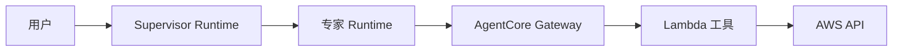

# China AgentCore Learning

在 AWS 中国区学 Amazon Bedrock AgentCore,并动手搭一个 CloudOps 多 Agent 应用。

五章,按顺序读。每章先讲概念,再动手。

| 章节 | 内容 | 读完会什么 |
| --- | --- | --- |
| [1. 中国区功能](01-china-region.md) | 六项可用服务、缺什么、怎么替代 | 知道中国区能用什么、设计时怎么选 |
| [2. Vibe coding 上手](02-vibe-coding.md) | AgentCore MCP 接到编码助手 | 让助手查文档、改代码、帮你部署 |
| [3. 构建指南](03-build.md) | Runtime → Gateway → Lambda | 跑通一条真实可部署的链路 |
| [4. CloudOps 实践](04-cloudops.md) | 四种协议 + 多 Agent 协作 | 用 Agent 回答真实运维问题 |
| [5. Harness 实践](05-harness.md) | 计划校验、依赖、状态、失败处理 | 让多 Agent 任务可靠执行并有终态 |

## 最终搭出什么



Supervisor 拆任务派给专家,专家通过 Gateway 调工具,工具查 AWS。

想先看效果,跑这个(离线,不需要 AWS 凭证):

```bash
cd labs/multi-agent && ./run.sh
```

一个 Supervisor + 两个专家,真实 A2A 协议通信,能看到并行和依赖调度。详见 [labs/multi-agent](labs/multi-agent/README.md)。

## 环境

Linux(Ubuntu/Amazon Linux),默认宁夏 `cn-northwest-1`。需要:

```bash
python3 --version      # 3.12+
docker --version       # 需支持 buildx 构建 arm64
aws --version          # 2.37+
uv --version           # 第 2 章用,提供 uvx
```

配好中国区身份:

```bash
export AWS_PROFILE=china-learning
export AWS_REGION=cn-northwest-1
export AWS_DEFAULT_REGION=cn-northwest-1
aws sts get-caller-identity
```

**模型另备**。AgentCore 服务独立于 LLM 模型:海外项目用 Bedrock 上的模型,中国区 Bedrock 没有基础模型,所以用 DeepSeek、通义千问这类第三方 API(OpenAI 兼容接口),配置就是三个环境变量:

```bash
export MODEL_BASE_URL="https://api.deepseek.com/v1"    # DeepSeek 为例
export MODEL_ID="deepseek-chat"
export MODEL_API_KEY="sk-xxxxxxxx"
```

第 3 章之前的实验不需要模型;到 [3.10 接模型](03-build.md#310-接模型从-echo-变成真-agent) 才用到,`labs/multi-agent` 用确定性规划器,不配模型也能跑。

实验创建的真实资源信息写在 `.local/`(已被 git 忽略)。实验会产生费用,做完按 [清理](03-build.md#清理) 删掉。

参考:[中国区功能差异](https://docs.amazonaws.cn/en_us/aws/latest/userguide/bedrock-agentcore.html) · [Runtime 协议契约](https://docs.amazonaws.cn/en_us/bedrock-agentcore/latest/devguide/runtime-service-contract.html) · [AWS CloudOps 参考项目](https://github.com/aws-samples/sample-cloudops-multi-agent-system)
